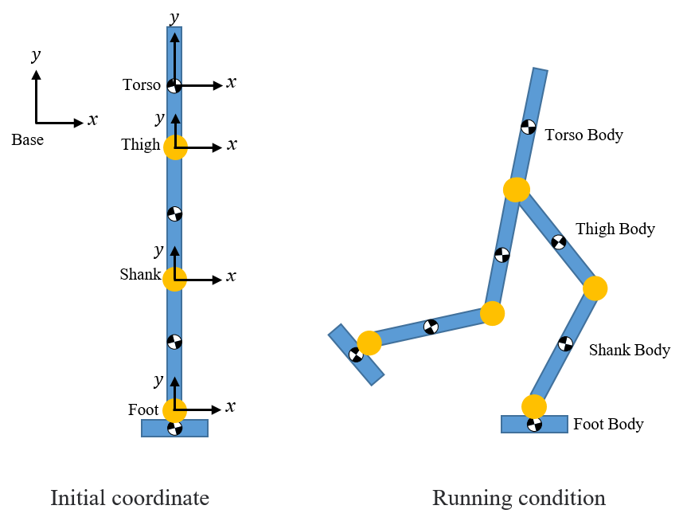

# PlannarBiped

## What is this project about

We want to demonstrate bipedal robot walking on rough terrain. In this project, we simulate plannar (sagittal plane) bipedal walking. 

With this initial effort, I am buiding bipedal model. This model should be with trunk, thighs, shanks, feet, and actuated by hip, knees, ankles. 
The model should be similar to the one in https://citeseerx.ist.psu.edu/document?repid=rep1&type=pdf&doi=056f1b09ca266af8a776fb8cf21c7100c99bc75b.
In the RobotDynamics folder, I implemented codes that symbolically calculates the lagrangian dynamics of the biped robot. I have so far only implemented 
the continous dynamics. The impact dynamics will come later. To find the continous lagrangian dynamics, the strategy is to calculate kinetic energy and 
potential energy by following the coordinate transformations. I implement it in Matlab with OOP fasion so that it is extendible and can be easily verified by simple systems (cart-pole system, 
two links systems).

During my implementation, I have learned from a few resources. 
1. Ayonga Hereid's Frost toolkit http://ayonga.github.io/frost-dev/. His project aims to search bipedal walking gaits. Also it targets on general 3D robot dynamics.
I feel this toolkit is too complicated and too general. For example, in order to have better symbolic calculation, the toolkits uses both Matlab and Mathematica. Even running
some demo code in that toolkit is not trivial. You guys can have a try and let me know if you are successful. There are definitely a lot we can lear from that toolkit.

2. Example code from Jesse Grizzle's Book "Feedback Control of Dynamic Bipedal Robot Locomotion". https://ece.umich.edu/faculty/grizzle/web-book.html. There are some Matlab code
attached in the website. But it is written in 2007 and in an old fasion non-OOP way. (It is hard to test and extend.)

3. There should be code attached with paper "Predicting human walking gaits with a simple planar model" https://www.sciencedirect.com/science/article/abs/pii/S0021929014000669
It is also written in old fasion.

## How to Play

1. Open Matlab, change path to '/ACC2024/RobotDynamics/@RigidBody2D/test'.
2. Run cartPoleExample.m or twoLinksExample.m
3. The scripts calculate kinetic energy and potential energy that will be used to find Lagrangian and dynamics equations.

## What is next

To achieve the research goal which I have explained to you, these are what we need to work on:
1. By far, I have just started the continous dynamics part. We still need impact dynamics. The lagragian dynamcis should be calculated symbolically and exported as matlab script
so that we can simulate them numerically.
 
2. We need to implement the HZD controller and also be able to find gaits for the model we derived.

3. We need a MPC controller.

Step 1 and 2 are relatively clear and step3 is more exploratory.

Please let me know what do you think and feel free to fetch the code and contribute to the repository.

The 7 links biped robot is modeled according following form:
